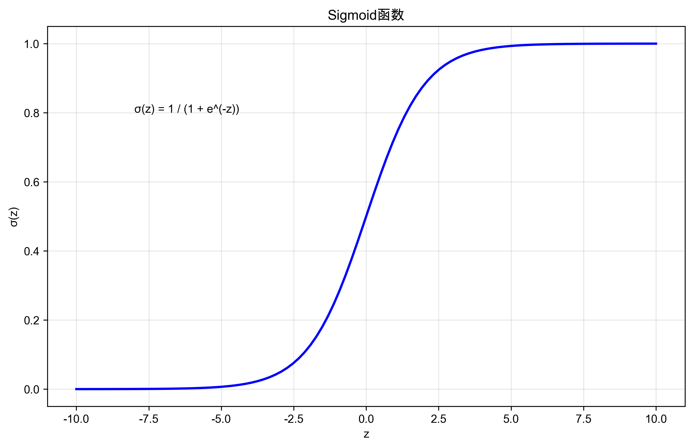
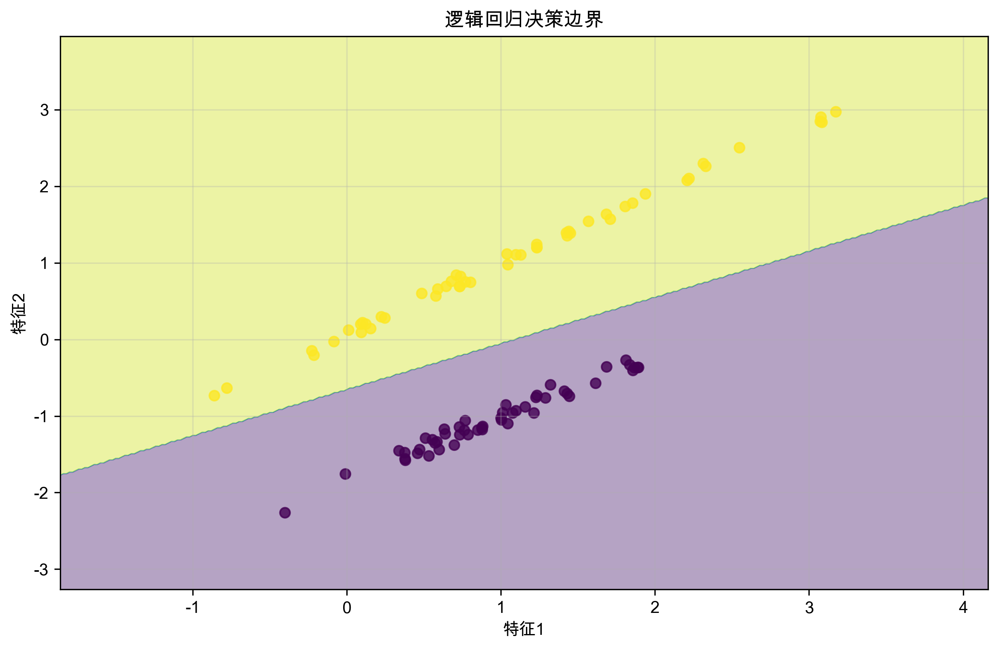

*分类算法是机器学习中最常用的技术之一，让我们系统地学习它们*

# 分类算法详解

## 本节概要

通过本节学习，你将：
- 理解各种分类算法的原理和数学基础
- 掌握不同分类器的实现方法和调优技巧
- 学会选择合适的分类算法解决实际问题
- 掌握处理不平衡数据集的策略
- 能够评估和优化分类模型的性能

💡 重点内容：
- 从线性回归到逻辑回归的推导过程
- 决策树的生长和剪枝策略
- 支持向量机的核技巧应用
- 集成学习提升模型性能

## 学习目标
完成本节后，你将能够：
- 理解主要分类算法的原理和特点
- 实现和使用各种分类器
- 选择合适的分类算法
- 评估分类模型的性能
- 处理不平衡数据集问题

## 先修知识
学习本节内容需要：
- Python编程基础
- 机器学习基础概念
- 数学和统计学基础
- 数据预处理知识

## 逻辑回归

### 从线性回归到逻辑回归
线性回归预测连续值，而分类问题需要预测离散类别。逻辑回归通过在线性回归的基础上添加sigmoid函数，将输出映射到[0,1]区间，从而实现二分类。


*Sigmoid函数将任意实数映射到(0,1)区间，是逻辑回归的核心组件*

### 数学原理

#### 1. 模型形式
对于输入特征x，逻辑回归模型的预测概率为：

```
P(y=1|x) = σ(w^T x + b)
```

其中：
- σ(z) = 1/(1+e^(-z)) 是sigmoid函数
- w是权重向量
- b是偏置项

#### 2. 损失函数
逻辑回归使用对数似然损失（Log Likelihood Loss）：

```
L(w) = -∑[y_i log(p_i) + (1-y_i)log(1-p_i)]
```

这个损失函数的特点：
- 当预测正确时，损失接近0
- 当预测错误时，损失很大
- 是一个凸函数，可以保证找到全局最优解

#### 3. 优化方法
使用梯度下降法优化：
1. 计算损失函数对w的梯度
2. 沿着梯度的反方向更新参数
3. 重复直到收敛

### 决策边界可视化

下面是一个简单的二维数据分类示例，展示了逻辑回归的决策边界：


*逻辑回归在二维特征空间中划分出一条直线作为决策边界*

### 实现示例

```python
import numpy as np
from sklearn.linear_model import LogisticRegression
from sklearn.datasets import make_classification

# 生成示例数据
X, y = make_classification(
    n_samples=1000,    # 样本数
    n_features=20,     # 特征数
    n_classes=2,       # 类别数
    random_state=42
)

# 创建和训练模型
model = LogisticRegression(
    penalty='l2',      # L2正则化
    C=1.0,            # 正则化强度的倒数
    solver='lbfgs'     # 优化算法
)
model.fit(X, y)

# 预测概率和类别
y_prob = model.predict_proba(X)    # 预测概率
y_pred = model.predict(X)          # 预测类别
```

### 优缺点分析

优点：
1. 模型简单，计算效率高
2. 可解释性强
3. 不易过拟合
4. 可以输出概率
5. 可以使用正则化

缺点：
1. 假设特征之间相互独立
2. 只能处理线性可分的问题
3. 对异常值敏感
4. 要求特征和目标变量之间是Sigmoid关系

### 应用场景

逻辑回归适用于：
1. 需要概率输出的场景
   - 垃圾邮件检测
   - 疾病风险预测
   - 信用评分

2. 需要可解释性的场景
   - 医疗诊断
   - 金融风控
   - 营销预测

3. 特征之间相对独立的场景
   - 文本分类
   - 简单图像分类
   - 用户行为预测

### 实践技巧

1. **特征工程**
   - 处理缺失值
   - 特征标准化
   - 处理类别特征
   - 特征选择

2. **参数调优**
   - 正则化类型（L1/L2）
   - 正则化强度（C值）
   - 优化器选择
   - 迭代次数

3. **模型评估**
   - 混淆矩阵
   - ROC曲线
   - PR曲线
   - 交叉验证

## K近邻算法(KNN)

### 原理与实现
KNN是一种基于实例的学习算法，通过计算样本间距离进行分类。

```python
from sklearn.neighbors import KNeighborsClassifier

# 创建KNN分类器
knn = KNeighborsClassifier(n_neighbors=5)
knn.fit(X, y)

# 预测
y_pred_knn = knn.predict(X)
```

### 选择最优K值
```python
from sklearn.model_selection import cross_val_score

def find_best_k(X, y, k_range):
    """
    通过交叉验证选择最优的K值
    """
    k_scores = []
    for k in k_range:
        knn = KNeighborsClassifier(n_neighbors=k)
        scores = cross_val_score(knn, X, y, cv=5)
        k_scores.append(scores.mean())
    
    return k_scores

# 测试不同的K值
k_range = range(1, 31)
k_scores = find_best_k(X, y, k_range)

# 可视化结果
plt.plot(k_range, k_scores)
plt.xlabel('K值')
plt.ylabel('交叉验证得分')
plt.title('不同K值的模型性能')
plt.show()
```

## 支持向量机(SVM)

### 线性SVM
```python
from sklearn.svm import SVC

# 创建线性SVM
svm_linear = SVC(kernel='linear')
svm_linear.fit(X, y)

# 预测
y_pred_svm = svm_linear.predict(X)
```

### 核方法
```python
# RBF核SVM
svm_rbf = SVC(kernel='rbf', C=1.0, gamma='scale')
svm_rbf.fit(X, y)

# 多项式核SVM
svm_poly = SVC(kernel='poly', degree=3)
svm_poly.fit(X, y)
```

## 决策树

### 决策树分类器
```python
from sklearn.tree import DecisionTreeClassifier
from sklearn.tree import plot_tree

# 创建决策树
dt = DecisionTreeClassifier(max_depth=5)
dt.fit(X, y)

# 可视化决策树
plt.figure(figsize=(20,10))
plot_tree(dt, filled=True, feature_names=[f'feature_{i}' for i in range(X.shape[1])])
plt.show()
```

### 特征重要性
```python
def plot_feature_importance(model, feature_names):
    """
    可视化特征重要性
    """
    importances = model.feature_importances_
    indices = np.argsort(importances)[::-1]
    
    plt.figure(figsize=(10,6))
    plt.title("特征重要性")
    plt.bar(range(X.shape[1]), importances[indices])
    plt.xticks(range(X.shape[1]), [feature_names[i] for i in indices], rotation=45)
    plt.show()
```

## 集成方法

### 随机森林
```python
from sklearn.ensemble import RandomForestClassifier

# 创建随机森林
rf = RandomForestClassifier(n_estimators=100, max_depth=5)
rf.fit(X, y)

# 预测
y_pred_rf = rf.predict(X)
```

### 梯度提升
```python
from sklearn.ensemble import GradientBoostingClassifier

# 创建梯度提升分类器
gb = GradientBoostingClassifier(n_estimators=100)
gb.fit(X, y)

# 预测
y_pred_gb = gb.predict(X)
```

## 模型评估

### 评估指标
```python
from sklearn.metrics import accuracy_score, precision_score, recall_score, f1_score
from sklearn.metrics import confusion_matrix, classification_report

def evaluate_classifier(y_true, y_pred):
    """
    评估分类器性能
    """
    print("准确率:", accuracy_score(y_true, y_pred))
    print("精确率:", precision_score(y_true, y_pred))
    print("召回率:", recall_score(y_true, y_pred))
    print("F1分数:", f1_score(y_true, y_pred))
    print("\n混淆矩阵:\n", confusion_matrix(y_true, y_pred))
    print("\n分类报告:\n", classification_report(y_true, y_pred))
```

### ROC曲线
```python
from sklearn.metrics import roc_curve, auc

def plot_roc_curve(y_true, y_prob):
    """
    绘制ROC曲线
    """
    fpr, tpr, _ = roc_curve(y_true, y_prob)
    roc_auc = auc(fpr, tpr)
    
    plt.figure(figsize=(10,6))
    plt.plot(fpr, tpr, color='darkorange', lw=2,
             label=f'ROC曲线 (AUC = {roc_auc:.2f})')
    plt.plot([0, 1], [0, 1], color='navy', lw=2, linestyle='--')
    plt.xlim([0.0, 1.0])
    plt.ylim([0.0, 1.05])
    plt.xlabel('假正率')
    plt.ylabel('真正率')
    plt.title('接收者操作特征曲线')
    plt.legend(loc="lower right")
    plt.show()
```

## 处理不平衡数据

### 重采样方法
```python
from imblearn.over_sampling import SMOTE
from imblearn.under_sampling import RandomUnderSampler
from imblearn.pipeline import Pipeline

# SMOTE过采样
smote = SMOTE()
X_resampled, y_resampled = smote.fit_resample(X, y)

# 随机欠采样
rus = RandomUnderSampler()
X_resampled, y_resampled = rus.fit_resample(X, y)

# 结合过采样和欠采样
pipeline = Pipeline([
    ('smote', SMOTE()),
    ('rus', RandomUnderSampler())
])
X_resampled, y_resampled = pipeline.fit_resample(X, y)
```

### 类别权重
```python
# 使用类别权重
weighted_model = LogisticRegression(class_weight='balanced')
weighted_model.fit(X, y)
```

## 实战项目：信用卡欺诈检测

### 数据准备
```python
# 加载数据
from sklearn.datasets import make_classification
X, y = make_classification(n_samples=10000, n_features=20,
                         n_classes=2, weights=[0.99, 0.01],
                         random_state=42)

# 数据分割
from sklearn.model_selection import train_test_split
X_train, X_test, y_train, y_test = train_test_split(
    X, y, test_size=0.2, random_state=42)
```

### 模型训练与评估
```python
# 创建模型管道
from sklearn.pipeline import Pipeline
from sklearn.preprocessing import StandardScaler

pipeline = Pipeline([
    ('scaler', StandardScaler()),
    ('classifier', RandomForestClassifier(class_weight='balanced'))
])

# 训练模型
pipeline.fit(X_train, y_train)

# 预测和评估
y_pred = pipeline.predict(X_test)
evaluate_classifier(y_test, y_pred)
```

## 练习与作业
1. 基础练习：
   - 实现逻辑回归的梯度下降
   - 使用不同核函数的SVM
   - 构建和可视化决策树

2. 进阶练习：
   - 实现交叉验证和网格搜索
   - 处理不平衡数据集
   - 比较不同分类器的性能

3. 项目实践：
   - 选择一个真实数据集进行分类
   - 实现完整的分类流程
   - 尝试不同的模型优化方法

## 常见问题
Q1: 如何选择合适的分类算法？
A1: 需要考虑以下因素：
- 数据规模和维度
- 特征的线性可分性
- 计算资源限制
- 模型可解释性需求
- 预测速度要求

Q2: 如何处理过拟合问题？
A2: 可以采用以下方法：
- 增加训练数据
- 使用正则化
- 减少模型复杂度
- 使用集成方法
- 特征选择

## 扩展阅读
- [scikit-learn分类算法指南](https://scikit-learn.org/stable/supervised_learning.html#supervised-learning)
- [不平衡学习](https://imbalanced-learn.org/stable/)
- [集成学习方法](https://scikit-learn.org/stable/modules/ensemble.html)

## 下一步学习
- 深度学习分类
- 序列分类
- 多标签分类
- 半监督学习
