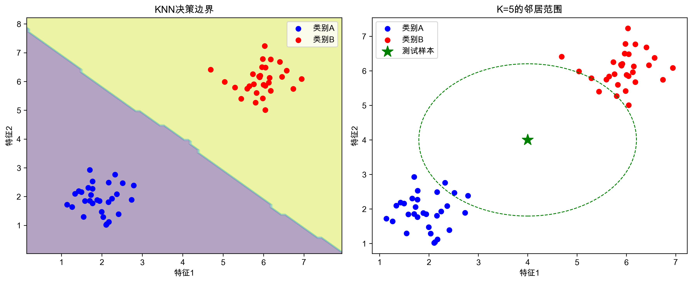
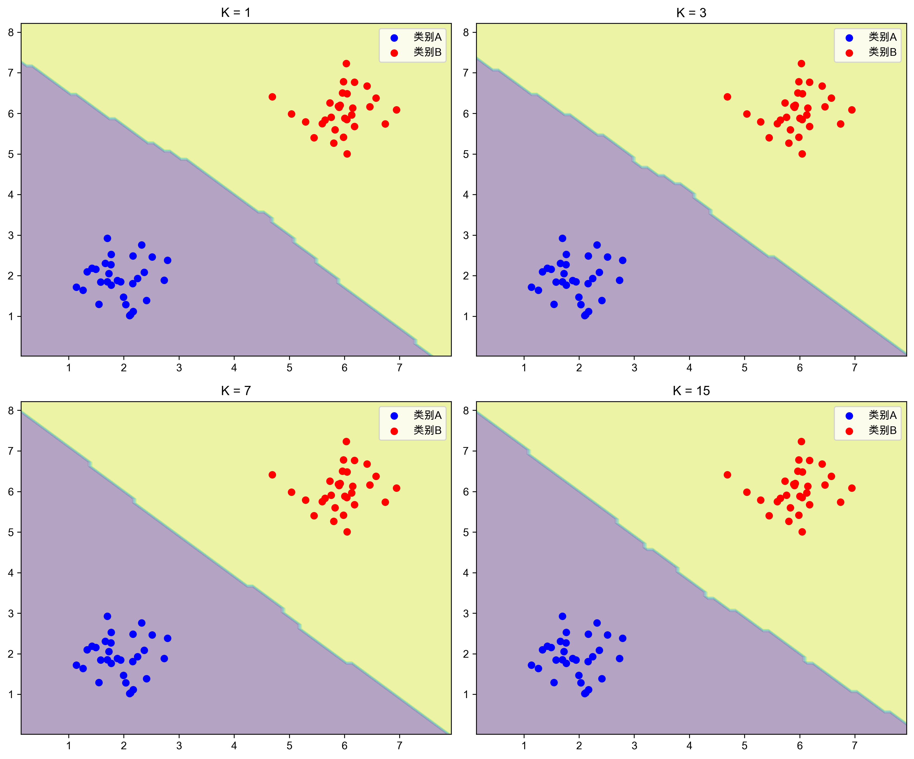
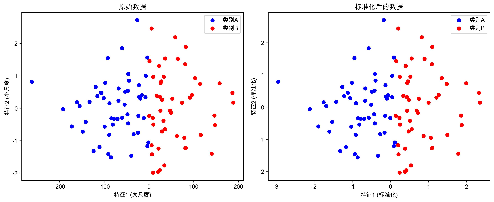
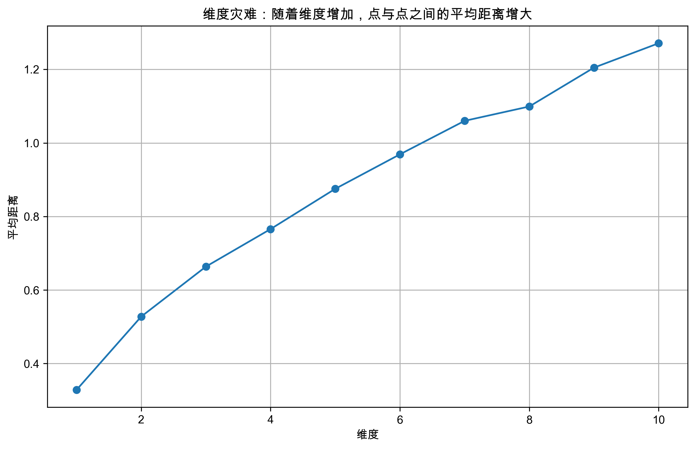

*通过最近邻的投票来预测未知样本，是机器学习中最直观的算法之一*

## 本节概要

通过本节学习，你将：
- 理解K近邻算法的基本原理和工作机制
- 掌握不同距离度量方法的特点和应用场景
- 学会从零实现一个KNN分类器
- 熟练使用scikit-learn中的KNN相关API

💡 重点内容：
- KNN算法的核心思想和基本步骤
- 距离度量方法的选择
- K值的选择策略和交叉验证
- KNN的优缺点和适用场景

## 1. KNN算法原理

### 1.1 基本思想

KNN的核心思想是：一个样本的类别由其最近的K个邻居的"投票"决定。这就像我们在生活中常说的"观察一个人，就看他/她的朋友圈"。


*左图展示了KNN的决策边界，右图显示了一个测试样本（绿星）的K=5近邻范围（虚线圆）*

### 1.2 算法步骤

1. **计算距离**：对于一个新样本，计算它与训练集中所有样本的距离
2. **找到K个最近邻**：选择距离最近的K个样本
3. **投票决策**：这K个样本进行投票，得票最多的类别就是预测结果


*不同K值对决策边界的影响：K值越小，决策边界越复杂；K值越大，决策边界越平滑*

- K=1：完全依赖最近的一个样本，容易过拟合
- K=3：在保持决策边界灵活性的同时，减少了噪声影响
- K=7：决策边界开始变得平滑
- K=15：决策边界非常平滑，但可能会忽略局部特征

### 1.3 距离度量方法

KNN算法中的"距离"可以用多种方式计算：

1. **欧氏距离**（最常用）：
   ```python
   distance = np.sqrt(np.sum((x1 - x2)**2))
   ```

2. **曼哈顿距离**：
   ```python
   distance = np.sum(np.abs(x1 - x2))
   ```

3. **闵可夫斯基距离**：
   ```python
   distance = np.power(np.sum(np.power(np.abs(x1 - x2), p)), 1/p)
   ```

### 1.4 特征缩放

由于KNN基于距离计算，特征的尺度对结果有很大影响：


*特征缩放前后的数据分布对比：左图是原始数据，右图是标准化后的数据。可以看到标准化后的特征分布更加均匀，有助于更准确地计算距离。*

### 1.5 维度灾难

KNN算法在高维空间中面临"维度灾难"问题：


*随着维度增加，样本点之间的平均距离急剧增大，使得"近邻"的概念变得不再可靠。这就是所谓的维度灾难。*

## 2. 从零实现KNN

### 2.1 基础实现

让我们从头实现一个简单的KNN分类器：

```python
import numpy as np
from collections import Counter

class SimpleKNN:
    def __init__(self, k=3):
        self.k = k
    
    def fit(self, X, y):
        self.X_train = X
        self.y_train = y
        
    def predict(self, X):
        predictions = []
        for x in X:
            # 计算与所有训练样本的距离
            distances = np.sqrt(np.sum((self.X_train - x)**2, axis=1))
            # 获取最近的k个样本的索引
            k_indices = np.argsort(distances)[:self.k]
            # 获取这k个样本的标签
            k_nearest_labels = self.y_train[k_indices]
            # 投票决定类别
            most_common = Counter(k_nearest_labels).most_common(1)
            predictions.append(most_common[0][0])
        return np.array(predictions)

# 创建并训练模型
knn = SimpleKNN(k=3)
knn.fit(X_train, y_train)

# 预测新样本
X_test = np.array([[3, 2], [7, 6]])
predictions = knn.predict(X_test)
```

### 2.2 使用scikit-learn实现

在实际应用中，我们通常使用scikit-learn的实现，它经过了优化并提供了更多功能：

```python
from sklearn.neighbors import KNeighborsClassifier
from sklearn.preprocessing import StandardScaler
from sklearn.model_selection import train_test_split
from sklearn.metrics import accuracy_score, classification_report

# 准备数据
X = [[10, 2], [8, 3], [2, 8], [3, 10], [1, 1]]  # 电影特征：[动作场景数, 爱情场景数]
y = [0, 0, 1, 1, 0]  # 电影类型：0表示动作片，1表示爱情片

# 数据标准化
scaler = StandardScaler()
X_scaled = scaler.fit_transform(X)

# 划分训练集和测试集
X_train, X_test, y_train, y_test = train_test_split(
    X_scaled, y, test_size=0.2, random_state=42
)

# 创建并训练模型
knn = KNeighborsClassifier(n_neighbors=3)
knn.fit(X_train, y_train)

# 预测
y_pred = knn.predict(X_test)

# 评估模型
print("准确率:", accuracy_score(y_test, y_pred))
print("\n分类报告:\n", classification_report(y_test, y_pred))
```

## 3. KNN算法的优化

### 3.1 K值选择

使用交叉验证来选择最优的K值：

```python
from sklearn.model_selection import cross_val_score
import matplotlib.pyplot as plt

# 测试不同的K值
k_values = range(1, 31, 2)
cv_scores = []

for k in k_values:
    knn = KNeighborsClassifier(n_neighbors=k)
    scores = cross_val_score(knn, X_scaled, y, cv=5)
    cv_scores.append(scores.mean())

# 找到最优K值
optimal_k = k_values[np.argmax(cv_scores)]
```

### 3.2 距离加权

考虑距离的影响，给距离较近的样本更大的权重：

```python
# 使用距离加权
knn_distance = KNeighborsClassifier(
    n_neighbors=5,
    weights='distance'  # 默认是'uniform'
)
knn_distance.fit(X_train, y_train)

# 预测新样本
X_test = np.array([[3, 2], [7, 6]])
pred_distance = knn_distance.predict_proba(X_test)
```

### 3.3 特征缩放

由于KNN基于距离计算，特征缩放非常重要：

```python
from sklearn.preprocessing import StandardScaler, MinMaxScaler

# 标准化：均值为0，方差为1
scaler = StandardScaler()
X_scaled = scaler.fit_transform(X)

# 或者归一化到[0,1]区间
scaler = MinMaxScaler()
X_normalized = scaler.fit_transform(X)
```

## 4. KNN的高级应用

### 4.1 KNN用于回归

KNN不仅可以用于分类，还可以用于回归：

```python
from sklearn.neighbors import KNeighborsRegressor

# 准备数据：房屋面积和价格
X = np.array([[50], [80], [120], [200], [300]])  # 房屋面积（平方米）
y = np.array([100, 150, 200, 300, 400])          # 房屋价格（万元）

# 创建并训练模型
knn_reg = KNeighborsRegressor(n_neighbors=2)  # 使用最近的2个邻居
knn_reg.fit(X, y)

# 预测新房屋的价格
X_test = np.array([[100], [250]])
predictions = knn_reg.predict(X_test)
```

### 4.2 使用KD树加速

当数据量大时，可以使用KD树来加速最近邻搜索：

```python
from sklearn.neighbors import KNeighborsClassifier

# 使用KD树算法
knn = KNeighborsClassifier(
    n_neighbors=3,
    algorithm='kd_tree'  # 默认是'auto'
)

# 训练模型
knn.fit(X_train, y_train)

# 预测
y_pred = knn.predict(X_test)
```

KD树通过将特征空间划分为多个区域，可以大大减少搜索最近邻时需要比较的样本数量。当维度不是特别高时（通常小于20维），KD树能显著提升KNN的性能。

### 4.3 异常检测

KNN还可以用于异常检测，通过计算样本与其最近邻的平均距离来判断是否异常：

```python
from sklearn.neighbors import NearestNeighbors

# 创建模型
nn = NearestNeighbors(n_neighbors=5)
nn.fit(X_normal)  # 只使用正常样本训练

# 计算每个样本到其最近邻的距离
distances, _ = nn.kneighbors(X_test)
avg_distances = distances.mean(axis=1)

# 设置阈值（例如：使用正常样本距离的95分位数）
_, normal_distances = nn.kneighbors(X_normal)
threshold = np.percentile(normal_distances.mean(axis=1), 95)

# 检测异常
anomalies = avg_distances > threshold
```

### 4.4 推荐系统

让我们用KNN实现一个简单的电影推荐系统：

```python
import pandas as pd
from sklearn.neighbors import NearestNeighbors

# 准备电影特征数据
movies_df = pd.DataFrame({
    'MovieID': range(1, 6),
    'Title': ['Movie A', 'Movie B', 'Movie C', 'Movie D', 'Movie E'],
    'Action': [8, 2, 7, 1, 9],
    'Romance': [1, 8, 2, 9, 0],
    'SciFi': [5, 3, 8, 2, 7]
})

# 提取特征并标准化
features = ['Action', 'Romance', 'SciFi']
X = movies_df[features].values
scaler = StandardScaler()
X_scaled = scaler.fit_transform(X)

# 创建KNN模型
nn = NearestNeighbors(n_neighbors=3)
nn.fit(X_scaled)

def recommend_similar_movies(movie_id):
    # 获取电影的特征向量
    movie_features = X_scaled[movie_id-1].reshape(1, -1)
    # 找到最相似的电影
    distances, indices = nn.kneighbors(movie_features)
    # 返回推荐结果
    similar_movies = movies_df.iloc[indices[0]]
    return similar_movies['Title'].tolist()

# 为每部电影推荐相似电影
for movie_id in range(1, 6):
    recommendations = recommend_similar_movies(movie_id)
```

**运行结果：**
```
>>> for movie_id in range(1, 6):
...     print(f"\n为电影 {movies_df.loc[movie_id-1, 'Title']} 推荐的相似电影：")
...     print(recommend_similar_movies(movie_id)[1:])  # 排除自己

为电影 Movie A 推荐的相似电影：
['Movie C', 'Movie E']

为电影 Movie B 推荐的相似电影：
['Movie D', 'Movie C']

为电影 Movie C 推荐的相似电影：
['Movie E', 'Movie A']

为电影 Movie D 推荐的相似电影：
['Movie B', 'Movie C']

为电影 Movie E 推荐的相似电影：
['Movie C', 'Movie A']
```

这个推荐系统根据电影的动作、爱情和科幻元素的比例来找到相似的电影。例如，对于动作元素较多的Movie A，系统推荐了同样包含较多动作元素的Movie C和Movie E。
