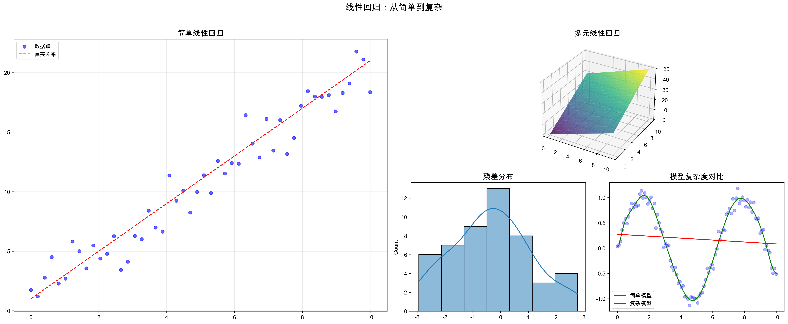
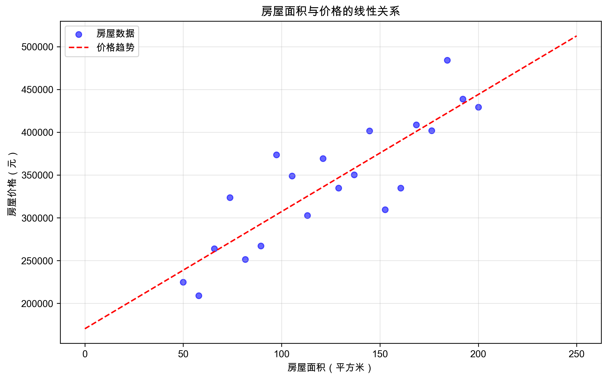
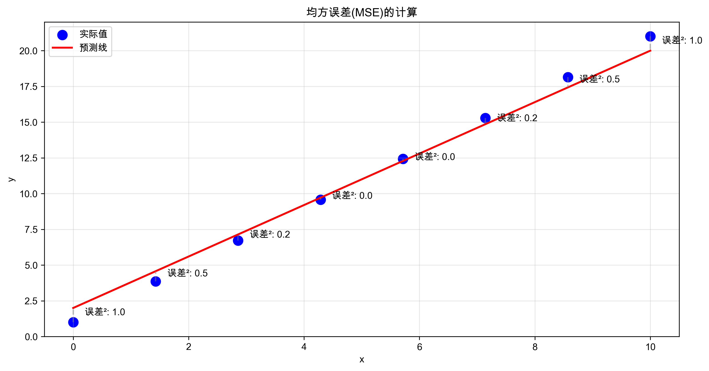
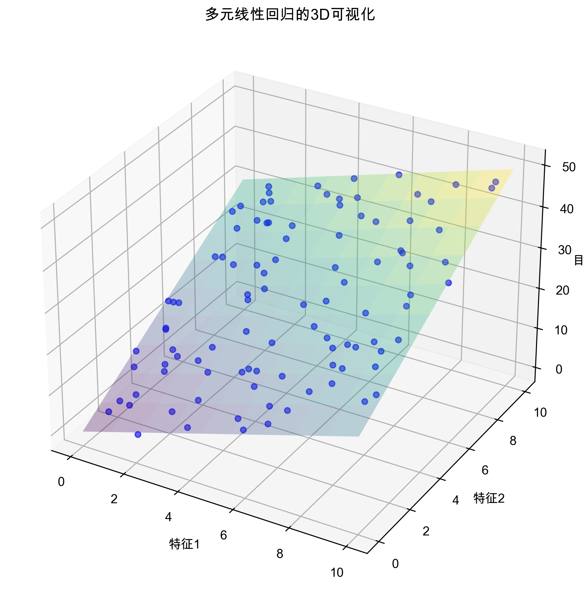
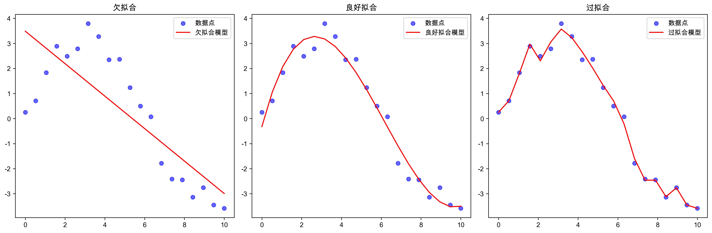

*线性回归是机器学习中最基础也最重要的算法之一*

# 线性回归详解

## 什么是线性回归？

想象你是一名房地产经纪人，你需要预测房屋的价格。你观察到：
- 房屋面积越大，价格通常越高
- 这种关系大致呈现一条直线

这就是最简单的线性关系！线性回归就是找到这条最佳拟合直线的方法。


*房屋面积与价格的线性关系示例*

### 生活中的线性关系
线性关系在生活中随处可见：
- 学习时间 vs 考试成绩
- 广告支出 vs 销售额
- 运动时间 vs 消耗的卡路里

## 线性回归的数学原理

### 1. 简单线性回归

最基本的线性回归公式是：
```
y = wx + b
```
其中：
- y 是我们要预测的值（例如房价）
- x 是输入特征（例如房屋面积）
- w 是权重（斜率）
- b 是偏置项（截距）


*线性回归公式的几何意义*

### 2. 如何找到最佳直线？

想象你有一张图纸和一根直尺：
1. 你可以随意放置这根直尺
2. 对于每个位置，测量所有点到直线的垂直距离
3. 找到使这些距离平方和最小的位置

这就是"最小二乘法"的直观理解！

```python
import numpy as np
import matplotlib.pyplot as plt

# 生成示例数据
np.random.seed(42)
X = 2 * np.random.rand(100, 1)  # 生成100个随机x值
y = 4 + 3 * X + np.random.randn(100, 1)  # 生成对应的y值，加入一些噪声

# 创建图形
plt.figure(figsize=(10, 6))
plt.scatter(X, y, color='blue', alpha=0.5, label='数据点')
plt.xlabel('特征 X (例如：房屋面积)')
plt.ylabel('目标值 y (例如：房价)')
plt.title('线性回归示例')

# 添加一条"猜测"的直线
plt.plot([0, 2], [4, 10], 'r--', label='可能的拟合线')
plt.plot([0, 2], [4, 10.5], 'g--', label='另一条可能的拟合线')

# 添加图例
plt.legend()
plt.show()
```

### 3. 损失函数：评估直线的好坏

如何衡量一条直线的好坏？我们使用均方误差(MSE)：
1. 计算每个预测值与实际值的差（误差）
2. 将误差平方（这样正负误差都变成正数）
3. 求所有平方误差的平均值


*均方误差的计算过程*

```python
def compute_mse(X, y, w, b):
    """计算均方误差"""
    predictions = w * X + b  # 预测值
    errors = predictions - y  # 误差
    squared_errors = errors ** 2  # 平方误差
    mse = np.mean(squared_errors)  # 平均值
    return mse
```

## 实践：预测房价

让我们用一个实际例子来理解线性回归：

```python
from sklearn.linear_model import LinearRegression
from sklearn.model_selection import train_test_split

# 准备数据：房屋面积（平方米）和价格（万元）
areas = np.array([[50], [60], [80], [100], [120], [150]])
prices = np.array([100, 130, 180, 200, 250, 300])

# 创建并训练模型
model = LinearRegression()
model.fit(areas, prices)

# 打印模型参数
print(f'预测公式: 价格 = {model.coef_[0]:.2f} × 面积 + {model.intercept_:.2f}')

# 可视化结果
plt.figure(figsize=(10, 6))
plt.scatter(areas, prices, color='blue', label='实际数据')
plt.plot(areas, model.predict(areas), color='red', label='预测线')
plt.xlabel('房屋面积（平方米）')
plt.ylabel('价格（万元）')
plt.title('房价预测模型')
plt.legend()
plt.show()
```

## 多元线性回归

现实世界中，房价不仅取决于面积，还受其他因素影响：
- 位置
- 房龄
- 楼层
- 装修情况

这就需要多元线性回归：
```
y = w₁x₁ + w₂x₂ + w₃x₃ + ... + b
```


*多个特征如何共同影响预测结果*

```python
# 多特征房价预测示例
X_multi = np.array([
    # 面积, 房龄, 楼层
    [50,  5,  3],
    [60,  2,  5],
    [80,  8,  2],
    [100, 1,  6],
    [120, 3,  4],
    [150, 4,  7]
])

# 训练多元线性回归模型
model_multi = LinearRegression()
model_multi.fit(X_multi, prices)

print("\n多元线性回归系数：")
print(f"面积的影响：{model_multi.coef_[0]:.2f}")
print(f"房龄的影响：{model_multi.coef_[1]:.2f}")
print(f"楼层的影响：{model_multi.coef_[2]:.2f}")
print(f"基础价格：{model_multi.intercept_:.2f}")
```

## 过拟合与欠拟合

### 什么是过拟合？
想象你在准备考试：
- 死记硬背例题 = 过拟合（只能应对见过的题目）
- 理解基本原理 = 良好拟合（能举一反三）
- 完全不学习 = 欠拟合（所有题目都不会）


*不同拟合状态的直观比较*

### 如何避免过拟合？

1. 正则化：给模型添加"惩罚项"
```python
from sklearn.linear_model import Ridge, Lasso

# 岭回归（L2正则化）
ridge_model = Ridge(alpha=1.0)
ridge_model.fit(X_multi, prices)

# Lasso回归（L1正则化）
lasso_model = Lasso(alpha=1.0)
lasso_model.fit(X_multi, prices)
```

2. 收集更多数据
3. 特征选择：只使用重要的特征

## 实战技巧

1. 数据预处理很重要：
   - 处理缺失值
   - 特征缩放
   - 异常值检测

2. 特征工程的艺术：
   - 创建交互特征
   - 多项式特征
   - 特征转换

3. 模型评估：
   - 使用交叉验证
   - 观察残差图
   - 计算R²分数

## 练习题

1. 基础概念题：
   - 什么是线性回归？
   - 为什么要使用最小二乘法？
   - 过拟合和欠拟合的区别是什么？

2. 编程练习：
   - 使用sklearn实现简单的房价预测
   - 尝试添加更多特征，观察预测效果
   - 实验不同的正则化参数

## 参考资源

- [scikit-learn线性回归文档](https://scikit-learn.org/stable/modules/linear_model.html)
- [线性代数基础](https://www.khan.academy.org/math/linear-algebra)
- [统计学习基础](https://book.douban.com/subject/33437381/)
- [Python数据科学手册](https://jakevdp.github.io/PythonDataScienceHandbook/)
