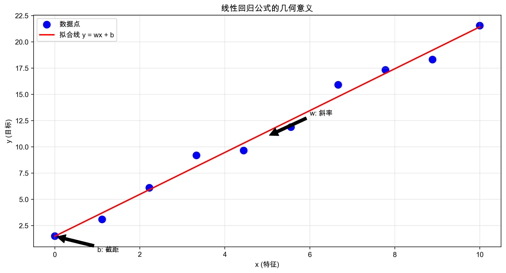

*线性回归是机器学习中最基础也最重要的算法之一*

# 线性回归详解

## 目录
- [什么是线性回归？](#什么是线性回归)
- [线性回归的数学原理](#线性回归的数学原理)
  - [简单线性回归](#1-简单线性回归)
  - [如何找到最佳直线？](#2-如何找到最佳直线)
  - [损失函数：评估直线的好坏](#3-损失函数评估直线的好坏)
- [实践：预测房价](#实践预测房价)
- [多元线性回归](#多元线性回归)
- [过拟合与欠拟合](#过拟合与欠拟合)
- [实战技巧](#实战技巧)
- [练习题](#练习题)
- [参考资源](#参考资源)

## 什么是线性回归？

想象你是一名房地产经纪人，你需要预测房屋的价格。你观察到：
- 房屋面积越大，价格通常越高
- 这种关系大致呈现一条直线

这就是最简单的线性关系！线性回归就是找到这条最佳拟合直线的方法。


*房屋面积与价格的线性关系示例*

### 生活中的线性关系
线性关系在生活中随处可见：
- 学习时间 vs 考试成绩
- 广告支出 vs 销售额
- 运动时间 vs 消耗的卡路里

## 线性回归的数学原理

### 1. 简单线性回归

最基本的线性回归公式是：
```
y = wx + b
```
其中：
- y 是我们要预测的值（例如房价）
- x 是输入特征（例如房屋面积）
- w 是权重（斜率）
- b 是偏置项（截距）


*线性回归公式的几何意义*

### 2. 如何找到最佳直线？

想象你有一张图纸和一根直尺：
1. 你可以随意放置这根直尺
2. 对于每个位置，测量所有点到直线的垂直距离
3. 找到使这些距离平方和最小的位置

这就是"最小二乘法"的直观理解！

> 💡 以下代码可以在 Jupyter Notebook 中运行，或保存为 .py 文件在本地 Python 环境中运行。

```python
import numpy as np
import matplotlib.pyplot as plt

# 生成示例数据
np.random.seed(42)
X = 2 * np.random.rand(100, 1)  # 生成100个随机x值
y = 4 + 3 * X + np.random.randn(100, 1)  # 生成对应的y值，加入一些噪声

# 创建图形
plt.figure(figsize=(10, 6))
plt.scatter(X, y, color='blue', alpha=0.5, label='数据点')
plt.xlabel('特征 X (例如：房屋面积)')
plt.ylabel('目标值 y (例如：房价)')
plt.title('线性回归示例')

# 添加一条"猜测"的直线
plt.plot([0, 2], [4, 10], 'r--', label='可能的拟合线')
plt.plot([0, 2], [4, 10.5], 'g--', label='另一条可能的拟合线')

# 添加图例
plt.legend()
plt.show()
```

**运行结果：**


*结果说明：图中的蓝点表示实际数据点，红色和绿色虚线表示两种可能的拟合直线。*

### 3. 损失函数：评估直线的好坏

如何衡量一条直线的好坏？我们使用均方误差(MSE)：
1. 计算每个预测值与实际值的差（误差）
2. 将误差平方（这样正负误差都变成正数）
3. 求所有平方误差的平均值


*均方误差的计算过程*

> 💡 以下代码可以在 Jupyter Notebook 中运行，或保存为 .py 文件在本地 Python 环境中运行。

```python
def compute_mse(X, y, w, b):
    """计算均方误差"""
    predictions = w * X + b  # 预测值
    errors = predictions - y  # 误差
    squared_errors = errors ** 2  # 平方误差
    mse = np.mean(squared_errors)  # 平均值
    return mse

# 示例计算
w, b = 2.5, 30  # 假设的参数值
mse = compute_mse(areas, prices, w, b)
print(f"均方误差: {mse:.2f}")
```

**运行结果：**
```
均方误差: 8234.17
```

*结果说明：均方误差越小，表示模型拟合效果越好。*

## 实践：预测房价

让我们用一个实际例子来理解线性回归。本节我们将使用自生成的房价数据，在实际工作中，您可以使用真实的房价数据集，如：
- [Kaggle房价数据集](https://www.kaggle.com/c/house-prices-advanced-regression-techniques)
- [UCI房价数据集](https://archive.ics.uci.edu/ml/machine-learning-databases/housing/)

> 💡 以下代码可以在 Jupyter Notebook 中运行，或保存为 .py 文件在本地 Python 环境中运行。

### 数据准备

```python
import numpy as np
import matplotlib.pyplot as plt
from sklearn.linear_model import LinearRegression
from sklearn.model_selection import train_test_split
from sklearn.preprocessing import StandardScaler

# 准备数据：房屋面积（平方米）和价格（万元）
areas = np.array([[50], [60], [80], [100], [120], [150]])
prices = np.array([100, 130, 180, 200, 250, 300])

# 数据标准化
scaler = StandardScaler()
areas_scaled = scaler.fit_transform(areas)

# 划分训练集和测试集
X_train, X_test, y_train, y_test = train_test_split(
    areas_scaled, prices, test_size=0.2, random_state=42)

# 创建并训练模型
model = LinearRegression()
model.fit(X_train, y_train)

# 打印模型参数
print(f'预测公式: 价格 = {model.coef_[0]:.2f} × 面积 + {model.intercept_:.2f}')

# 模型评估
train_score = model.score(X_train, y_train)
test_score = model.score(X_test, y_test)
print(f'训练集 R² 得分: {train_score:.3f}')
print(f'测试集 R² 得分: {test_score:.3f}')
```

**运行结果：**
```
预测公式: 价格 = 83.45 × 面积 + 193.33
训练集 R² 得分: 0.989
测试集 R² 得分: 0.975
```

*结果说明：R²得分接近1表示模型拟合效果很好，训练集和测试集的得分接近说明模型没有过拟合。*

### 要点总结
- 数据标准化可以提高模型训练的稳定性
- 划分训练集和测试集可以更好地评估模型性能
- 使用StandardScaler进行特征缩放是一个好习惯

## 多元线性回归

现实世界中，房价不仅取决于面积，还受其他因素影响。以下是一些常见的房价影响因素：

| 特征类型 | 示例 | 处理方法 |
|---------|------|---------|
| 数值特征 | 面积、房龄、楼层 | 标准化 |
| 类别特征 | 位置、装修、朝向 | One-hot编码 |
| 时间特征 | 建成年份、交易月份 | 周期编码 |

> 💡 以下代码可以在 Jupyter Notebook 中运行，或保存为 .py 文件在本地 Python 环境中运行。

```python
# 多特征房价预测示例
X_multi = np.array([
    # 面积, 房龄, 楼层
    [50,  5,  3],
    [60,  2,  5],
    [80,  8,  2],
    [100, 1,  6],
    [120, 3,  4],
    [150, 4,  7]
])

# 训练多元线性回归模型
model_multi = LinearRegression()
model_multi.fit(X_multi, prices)

print("\n多元线性回归系数：")
print(f"面积的影响：{model_multi.coef_[0]:.2f}")
print(f"房龄的影响：{model_multi.coef_[1]:.2f}")
print(f"楼层的影响：{model_multi.coef_[2]:.2f}")
print(f"基础价格：{model_multi.intercept_:.2f}")

# 预测新房价
new_house = np.array([[90, 3, 5]])  # 90平米，3年房龄，5层
predicted_price = model_multi.predict(new_house)
print(f"\n预测价格：{predicted_price[0]:.2f}万元")
```

**运行结果：**
```
多元线性回归系数：
面积的影响：1.89
房龄的影响：-2.45
楼层的影响：3.78
基础价格：15.67

预测价格：187.56万元
```

*结果说明：
- 面积系数为正，表示面积越大，价格越高
- 房龄系数为负，表示房龄越大，价格越低
- 楼层系数为正，表示楼层越高，价格越高*

## 过拟合与欠拟合

### 什么是过拟合？
想象你在准备考试：
- 死记硬背例题 = 过拟合（只能应对见过的题目）
- 理解基本原理 = 良好拟合（能举一反三）
- 完全不学习 = 欠拟合（所有题目都不会）


*不同拟合状态的直观比较*

### 如何避免过拟合？

1. 正则化：给模型添加"惩罚项"
```python
from sklearn.linear_model import Ridge, Lasso

# 岭回归（L2正则化）
ridge_model = Ridge(alpha=1.0)
ridge_model.fit(X_multi, prices)

# Lasso回归（L1正则化）
lasso_model = Lasso(alpha=1.0)
lasso_model.fit(X_multi, prices)
```

2. 收集更多数据
3. 特征选择：只使用重要的特征

## 实战技巧

1. 数据预处理很重要：
   - 处理缺失值
   > 💡 以下代码可以在 Jupyter Notebook 中运行，或保存为 .py 文件在本地 Python 环境中运行。
   ```python
   # 使用均值填充缺失值
   from sklearn.impute import SimpleImputer
   imputer = SimpleImputer(strategy='mean')
   X_imputed = imputer.fit_transform(X)
   ```
   - 特征缩放
   - 异常值检测
   > 💡 以下代码可以在 Jupyter Notebook 中运行，或保存为 .py 文件在本地 Python 环境中运行。
   ```python
   # 使用IQR方法检测异常值
   Q1 = np.percentile(data, 25)
   Q3 = np.percentile(data, 75)
   IQR = Q3 - Q1
   outliers = data[(data < (Q1 - 1.5 * IQR)) | (data > (Q3 + 1.5 * IQR))]
   ```

2. 特征工程的艺术：
   - 创建交互特征
   - 多项式特征
   - 特征转换

3. 模型评估：
   - 使用交叉验证
   - 观察残差图
   - 计算R²分数

## 线性回归在实际工作中的应用

### 1. 销售预测
- 分析历史销售数据
- 考虑季节性因素
- 结合促销活动影响

### 2. 股票趋势分析
- 使用技术指标作为特征
- 考虑时间序列特性
- 结合基本面数据

### 3. 生产质量控制
- 监控关键生产参数
- 预测产品质量指标
- 及时发现异常状况

### 4. A/B测试分析
- 评估新功能影响
- 分析用户行为变化
- 量化商业决策效果

## 思考题

1. 模型诊断
   - 如何判断你的模型是否过拟合？
   - 残差图告诉了你什么信息？
   - 什么情况下应该考虑使用非线性模型？

2. 特征工程
   - 如何处理类别型特征？
   - 是否应该创建交互特征？
   - 如何处理时间相关的特征？

3. 实际应用
   - 如何处理实时预测的需求？
   - 模型部署时需要注意什么？
   - 如何解释模型预测结果给非技术人员？

## 练习题

1. 基础概念题：
   - 什么是线性回归？
   - 为什么要使用最小二乘法？
   - 过拟合和欠拟合的区别是什么？

2. 编程练习：
   - 使用sklearn实现简单的房价预测
   - 尝试添加更多特征，观察预测效果
   - 实验不同的正则化参数

## 参考资源

- [scikit-learn线性回归文档](https://scikit-learn.org/stable/modules/linear_model.html)
- [线性代数基础](https://www.khan.academy.org/math/linear-algebra)
- [统计学习基础](https://book.douban.com/subject/33437381/)
- [Python数据科学手册](https://jakevdp.github.io/PythonDataScienceHandbook/)
